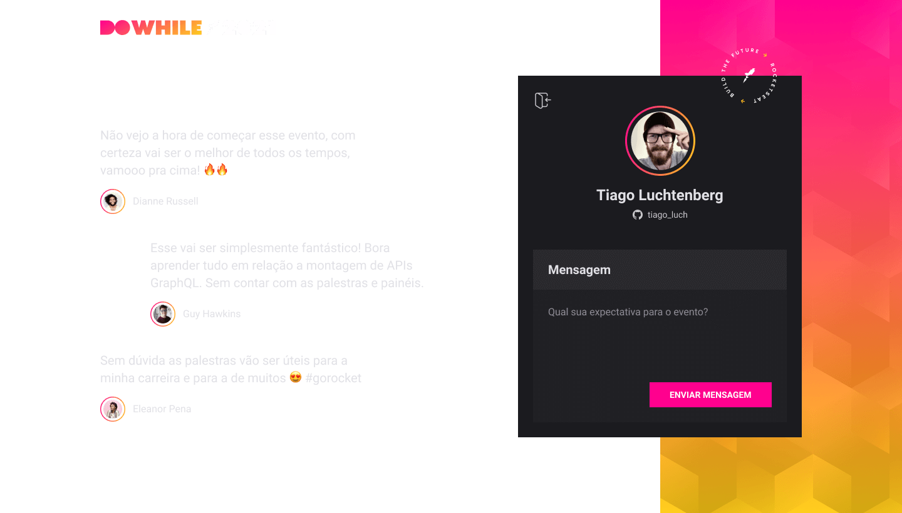

 
 
<h1 align="center">
   
   
   
   
  Node | Prisma | NextJS | Expo | Typescript
</h1>

  
  
  
  
   

 
 
 

## :bookmark: Resumo
 

Este projeto consiste no envio de comentários, comentários estes que são refletidos em tempo real na página web
e também no aplicativo do projeto, além disso ainda temos a autenticação utilizando a api do github, quando alguem está
autenticado é que se pode enviar os comentários.

O projeto foi desenvolvido durante a NLW-HEAT organizado pelo time da @Rocketseat, neste evento desenvolvemos
uma API rest com node, uma página web com react e um app mobile (android e apple) onde todos se comunicam entre sí.

Porém no meu projeto eu fui além, utilizei tecnologias que não foram abordadas no evento (as tecnologias serão citadas 
mais abaixo), considere isso a "milha-extra" que a Rocketseat sempre nos incentiva a seguir!

 

## :eyes: Prévia

 

Uma simples prévia de como o projeto está quando executado, caso queira executá-lo você mesmo em sua máquina,
basta seguir para o tópico "Colocando o projeto para rodar".

 
 

   

 
 

   

 

## :bulb: Tecnologias utilizadas
 

- Typescript
- Node
- React
- React-Native
- Expo
- Prisma

 

## :rocket: Milha extra
 

Foram adicionadas algumas funcionalidades extras e efeitos visuais para melhorar e tornar o projeto 
ainda mais intuítivo, lembrando que este projeto foi desenvolvido por mim utilizando o NEXTJS, 
dentre as funcionalidades extras estão:

- NextJS ao inves de react puro;
- Container docker com mysql & nodejs;
- Utilização do banco MySQL;
- Commitlint + commitizen + husky (padronizando commits);
- Styled components;
- Toasts de avisos do sistemas usando o react-hot-toast;
- Variáveis ambiente para todo o projeto;
- Alteração na rota de listagem de comentários, agora é passado pela URL a quantidade de comentários que for desejada;
- Tratamento de erros (capturando erros com middlewares) na API;
- Tratamento de dados do request com Celebrate + Joi;

 

## :wrench: Colocando o projeto para rodar
 

Para colocar o projeto para rodar, basta seguir o passo a passo fornecido logo abaixo:

- 1º: Tenha o NODE e o DOCKER instalados na sua máquina;
- 2º: Faça o download deste projeto;
- 3º: Configure as variaveis de ambiente, para isso veja o tutorial em [variaveis-ambiente](https://github.com/EddyPBR/letmeask/tree/main/.github/variaveis-ambiente)
- 4º: No terminal, dentro do diretório da API execute os seguintes comandos:
  - `yarn`
  - `yarn build`
  - `docker-compose up`
  - `yarn prisma migrate dev`
- 6º: No terminal, dentro do diretório da WEB execute os seguintes comandos:
  - `yarn`
  - `yarn build`
  - `yarn start`
- 7º: Para executar o app, é necessário que você instale o EXPO no seu dispositivo mobile. Com o aplicativo instalado faça o seguinte:
- 8º: No terminal, dentro do diretório do APP mobile execute os comandos:
  - `yarn`;
  - `yarn start`;
- 9º: Agora leia o QRCode com o EXPO APP.
- 10º: Pronto tudo executando :)

 

## :question: Rotas existentes

Para ver as rotas da API, basta acessar o arquivo `Insomnia` que se encontra na raiz deste projeto,
você pode exportá-lo para utilizar no insomnia e começar a efetuar requisições para o server.

 

## :memo: License

Este projeto esta sob a [MIT license](LICENSE) para mais detalhes.
 
 

## :wave: Social

Siga @EddyPBR nas redes :wink:
 

- [Instagram](https://www.instagram.com/eddy_pbr/)
- [LinkedIn](https://www.linkedin.com/in/eddypbr/)

 

Siga a @Rocketeat nas redes
 

- [Website](https://rocketseat.com.br/)
- [YouTube](https://www.youtube.com/channel/UCSfwM5u0Kce6Cce8_S72olg)
- [Instagram](https://www.instagram.com/rocketseat_oficial/?hl=pt-br)
